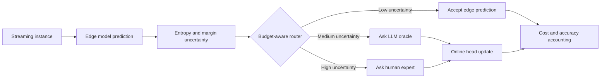

# Symbiosis-Edge

**Cost-aware drift adaptation for edge AI with LLM oracles and human experts.**

[](LICENSE)
[](https://www.python.org/)
[](docs/experiments.md)
[](CITATION.cff)

Symbiosis-Edge studies a simple question with practical consequences:

> When an edge model becomes uncertain under concept drift, should the system trust the edge model, ask an LLM oracle, or spend scarce human expert attention?

The repository provides simulation code, baselines, ablations, and LLM-backed oracle variants for evaluating **supervision routing under cost, latency, and budget constraints**.

## Why Cite This Work

Use Symbiosis-Edge as a reference implementation when your work involves:

| Research need | What this repository provides |
| --- | --- |
| Cost-aware concept drift adaptation | Routing policies that optimize accuracy gain against supervision cost |
| Human-in-the-loop edge AI | Explicit human budget constraints and expert escalation logic |
| LLMs as weak oracles | Chatbase, Llama 3, and Mistral oracle scripts with strict JSON label contracts |
| Reproducible drift experiments | Synthetic, SECOM, and APS stream experiments with paper-style plots and tables |
| Active learning baselines | Static, SAL, ADWIN-SAL, and ablated Symbiosis-Edge variants |

## Main Idea

Most drift-handling pipelines treat supervision as a binary choice: query or do not query. Symbiosis-Edge treats it as an **allocation problem** across three agents:

| Agent | Cost | Strength | Role |
| --- | --- | --- | --- |
| Edge model | Approx. 0 | Fast local inference | Handles routine predictions |
| LLM oracle | Moderate | Broad zero-shot reasoning | Resolves ambiguous cases and provides explanations |
| Human expert | High | Ground-truth authority | Validates critical or expensive decisions |

The policy routes each uncertain instance to the least costly agent expected to provide enough utility, while respecting oracle and human supervision budgets.



## Contributions

1. A cost-theoretic formulation of drift adaptation as supervision allocation rather than binary query selection.
2. A budget-aware routing policy that separates edge, oracle, and human decisions through adaptive quantile thresholds.
3. Reproducible experiments comparing Static, SAL, ADWIN-SAL, and Symbiosis-Edge across multiple drift streams.
4. Provider-specific LLM oracle implementations for studying the practical role of large language models in online adaptation.

## Highlights

- **>50% lower supervision cost** compared with single-oracle strategies in the reported experiments.
- **Up to 2x higher cost efficiency** measured as accuracy gain per unit cost.
- **Post-drift recovery in roughly 40 samples** in abrupt-drift settings.
- **Budget-aware routing** through sliding-window quantile thresholds.
- **LLM oracle variants** for Chatbase, Groq Llama 3, and Mistral AI.

## Results Snapshot

| Dataset | Method | Total Cost | Mean Accuracy | AGUC |
| --- | --- | ---: | ---: | ---: |
| Synthetic | SAL | 2900 | 0.871 | 0.082 |
| Synthetic | ADWIN-SAL | 2870 | 0.906 | 0.095 |
| Synthetic | Symbiosis-Edge | **1273** | **0.935** | **0.237** |
| SECOM | SAL | 3000 | 0.868 | 0.080 |
| SECOM | ADWIN-SAL | 2980 | 0.906 | 0.093 |
| SECOM | Symbiosis-Edge | **1291** | **0.950** | **0.250** |
| APS | SAL | 3060 | 0.851 | 0.071 |
| APS | ADWIN-SAL | 2960 | 0.901 | 0.090 |
| APS | Symbiosis-Edge | **1354** | **0.940** | **0.225** |

AGUC means **Accuracy Gain per Unit Cost**:

```text
AGUC = (Accuracy_method - Accuracy_static) / TotalCost
```

## How It Works

The routing objective combines error penalty and supervision cost:

```text
J = sum_t [1(y_hat_t != y_t) * lambda_err + C_pi(x_t)]
```

Uncertainty comes from edge-model entropy:

```text
u_E(x) = -sum_k p_k(x) log p_k(x)
```

Budget-aware thresholds are estimated from sliding-window quantiles:

```text
tau_human = Quantile_{1 - B_H}(D_W)
tau_oracle = Quantile_{1 - (B_H + B_O)}(D_W)
```

Only the classification head is updated online; the feature extractor remains frozen to keep adaptation lightweight for edge deployment.

## Repository Layout

```text
.
|-- scripts/
|   |-- run_multi_dataset.py
|   |-- run_single_run.py
|   |-- run_without_adwin.py
|   |-- run_chatbase_oracle.py
|   |-- run_llama3_oracle.py
|   `-- run_mistral_oracle.py
|-- docs/
|   `-- experiments.md
|-- CITATION.cff
|-- requirements.txt
|-- .env.example
|-- LICENSE
`-- README.md
```

Generated figures and tables are written to `paper_figures/` and `paper_tables/`.

## Quick Start

```bash
python -m venv .venv
source .venv/bin/activate
pip install -r requirements.txt
python scripts/run_single_run.py
```

On Windows PowerShell:

```powershell
python -m venv .venv
.\.venv\Scripts\Activate.ps1
pip install -r requirements.txt
python scripts\run_single_run.py
```

Run the full offline experiment:

```bash
python scripts/run_multi_dataset.py
```

## LLM Oracle Runs

Copy `.env.example`, set the provider credentials, and export the variables in your shell.

```bash
python scripts/run_chatbase_oracle.py
python scripts/run_llama3_oracle.py
python scripts/run_mistral_oracle.py
```

The oracle scripts expect strict JSON responses:

```json
{"label": 0}
```

## Citation

If this repository helps your research, please cite it. Until venue metadata is available, use the software citation below.

```bibtex
@software{MartinezGil2026SymbiosisEdge,
  author = {Martinez-Gil, Jorge},
  title = {Symbiosis-Edge: Cost-Aware Drift Adaptation with Edge Models, LLM Oracles, and Human Experts},
  year = {2026},
  license = {MIT},
  note = {Research software for cost-aware supervision routing under concept drift}
}
```

GitHub also detects the repository-level [CITATION.cff](CITATION.cff) file and can expose a "Cite this repository" button.

## License

This project is licensed under the [MIT License](LICENSE).

## Contact

Questions or collaboration: [jorge.martinez-gil@scch.at](mailto:jorge.martinez-gil@scch.at)

Software Competence Center Hagenberg (SCCH), Softwarepark 32a, 4232 Hagenberg, Austria.
