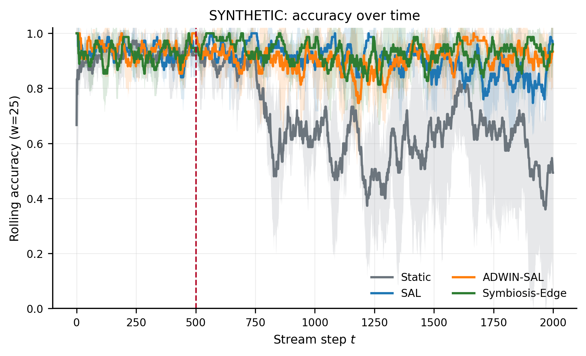
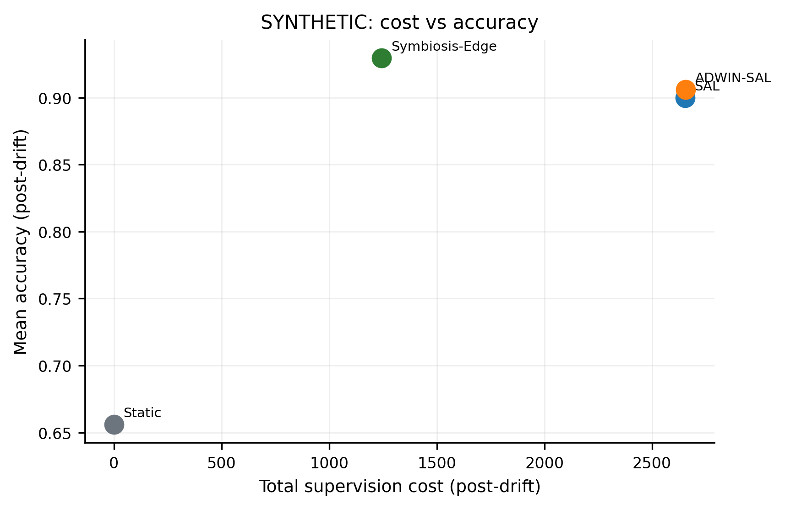
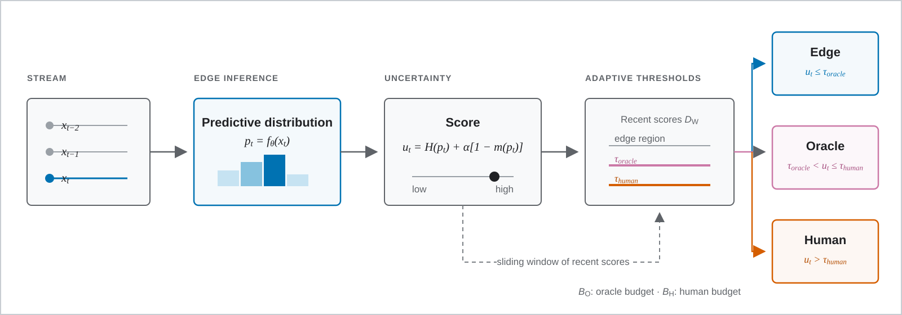

<h1 align="center">Symbiosis-Edge</h1>

<p align="center">
  <strong>Drift Adaptation as Supervision Routing Under Heterogeneous Costs</strong>
</p>

<p align="center">
  Jorge Martinez-Gil · Florian Bachinger · Rudolf Ramler · Francois Picard · Leïla Belmerhnia · Georgios Spathoulas
</p>

<p align="center">
  DEXA 2026 · Reference implementation and reproducibility package
</p>

<p align="center">
  <a href="https://github.com/jorge-martinez-gil/symbiosis-edge/actions/workflows/ci.yml"></a>
  <a href="https://www.python.org/"></a>
  <a href="docs/experiments.md"></a>
  <a href="CITATION.cff"></a>
  <a href="LICENSE"></a>
  <a href="CONTRIBUTING.md"></a>
</p>

<p align="center">
  <a href="#quickstart"><strong>Quickstart</strong></a> ·
  <a href="#key-results"><strong>Results</strong></a> ·
  <a href="#method"><strong>Method</strong></a> ·
  <a href="#citation"><strong>Citation</strong></a> ·
  <a href="docs/methodology.md"><strong>Methodology</strong></a>
</p>

<br>

<details>
<summary><strong>Table of contents</strong></summary>

- [Overview](#overview)
- [Key results](#key-results)
- [Method](#method)
  - [Compared policies](#compared-policies)
  - [Cost model](#cost-model)
- [Quickstart](#quickstart)
- [Results](#results)
- [Statistical analysis](#statistical-analysis)
- [Python interface](#python-interface)
- [LLM-oracle variants](#llm-oracle-variants)
- [Repository structure](#repository-structure)
- [Documentation](#documentation)
- [Citation](#citation)
- [License and contact](#license-and-contact)

</details>

## Overview

Symbiosis-Edge studies online classification under concept drift when supervision can be obtained from heterogeneous sources. At each stream step, a routing policy chooses among local edge inference, a machine oracle, and a human expert. These alternatives differ in cost, reliability, and availability. The benchmark evaluates whether uncertainty-based, budget-aware routing can improve post-drift predictive performance while reducing supervision cost.

The repository contains the simulation model used in the accompanying DEXA 2026 paper, baseline policies, statistical analysis, figure and table generation, optional LLM-provider integrations, and a command-line interface for reproducing the reported experiments.

**Research question.** How should an online classifier allocate uncertain instances among edge, machine-oracle, and human-expert tiers when the data distribution changes and supervision is costly?

> **Experimental scope.** The bundled experiments are a **controlled parametric simulation** of routing dynamics. They do not train classifiers on the raw SECOM or APS datasets. `SYNTHETIC`, `SECOM`, and `APS` identify parameter presets inherited from the accompanying study; no external dataset is loaded by the simulation path. Each method maintains a scalar accuracy state that evolves before and after a configured drift point, and queried annotations modify this state according to the assumed annotator reliability and learning rate. This design isolates the supervision-routing mechanism and makes runs deterministic, but it should not be interpreted as an empirical evaluation of trained models on the named raw datasets. Full assumptions and limitations are in [docs/methodology.md](docs/methodology.md); support for real streaming datasets is discussed in [docs/extending.md](docs/extending.md).

## Key results

Post-drift means across five seeds, within the bundled parametric simulation:

| | |
|:---|:---|
| **Accuracy** | Highest mean post-drift accuracy on all three presets |
| **Supervision cost** | 50 to 57% lower than the single-tier baselines |
| **Significance** | Holm-adjusted `p < 0.01` against each baseline with ten seeds |

<p align="center">
  
  
</p>

<p align="center"><em>Figure 1. Accuracy dynamics and the post-drift cost-accuracy relationship for the SYNTHETIC preset.</em></p>

The full results table with all three presets is in [Results](#results); the statistical procedure is in [Statistical analysis](#statistical-analysis).

## Method

<p align="center">
  
</p>

<p align="center"><em>Figure 2. Online routing from predictive uncertainty to edge, oracle, or human supervision.</em></p>

Let `p_t` denote the edge model's predictive probability vector at stream step `t`. Uncertainty combines Shannon entropy with the top-two probability margin:

```text
u_t = H(p_t) + α [1 − margin(p_t)]
```

For a sliding window `D_W` of recent uncertainty scores, the human and oracle thresholds are

```text
τ_human  = Quantile_{1 − B_H}(D_W)
τ_oracle = Quantile_{1 − (B_H + B_O)}(D_W),
```

where `B_H` and `B_O` are the human and oracle supervision budgets. The action is

```text
human,  if u_t > τ_human
oracle, if τ_oracle < u_t ≤ τ_human
edge,   otherwise.
```

### Compared policies

| Method | Supervision | Policy |
|:---|:---|:---|
| **Static** | None | Never requests supervision. |
| **SAL** | Single tier | Queries when uncertainty exceeds a budget-derived threshold. |
| **ADWIN-SAL** | Single tier | Temporarily increases the query budget after an ADWIN-style change alarm. |
| **Symbiosis-Edge** | Oracle and human | Uses nested thresholds to allocate the most uncertain instances to the human tier and the remainder of the query budget to the oracle tier. |

### Cost model

The default per-event costs are zero for edge inference, one for an oracle query, and ten for a human annotation. All values are configurable. Accuracy Gain per Unit Cost is computed on the post-drift segment:

```text
AGUC = (accuracy_method − accuracy_static) / total_cost.
```

The complete formal specification is in [docs/methodology.md](docs/methodology.md).

## Quickstart

```bash
git clone https://github.com/jorge-martinez-gil/symbiosis-edge
cd symbiosis-edge
pip install -e .
symbiosis-edge run --seeds 5 --out results
```

For a short validation run instead of the full benchmark:

```bash
symbiosis-edge run --quick --out /tmp/se-smoke
```

<details>
<summary><strong>Output artifacts</strong></summary>

<br>

| Artifact | Description |
|:---|:---|
| `summary.csv` | Mean post-drift metrics by preset and method |
| `summary_ci.csv` | Means and Student-t confidence intervals |
| `significance.csv` | Paired permutation tests, adjusted p-values, and effect sizes |
| `raw_runs.csv.gz` | Per-step records for every preset, method, and seed |
| `figures/` | Accuracy trajectories, cost-accuracy plots, and Pareto frontiers |
| `tables/` | LaTeX cost and significance tables |
| `manifest.json` | Environment, commit, parameters, seeds, statistical settings, and SHA-256 checksums |

</details>

<details>
<summary><strong>Configurable options</strong></summary>

<br>

```bash
symbiosis-edge run \
  --datasets SECOM APS \
  --seeds 10 \
  --cost-oracle 2 \
  --cost-human 20 \
  --ci 0.99 \
  --out results
```

</details>

## Results

Post-drift means across five seeds are shown below.

| Preset | Method | Total cost | Accuracy | Macro-F1 |
|:---|:---|---:|---:|---:|
| SYNTHETIC | SAL | 2,640 | 0.888 | 0.888 |
|  | ADWIN-SAL | 2,824 | 0.916 | 0.916 |
|  | **Symbiosis-Edge** | **1,252** | **0.929** | **0.929** |
| SECOM | SAL | 3,126 | 0.876 | 0.875 |
|  | ADWIN-SAL | 2,904 | 0.908 | 0.908 |
|  | **Symbiosis-Edge** | **1,348** | **0.950** | **0.950** |
| APS | SAL | 2,888 | 0.867 | 0.867 |
|  | ADWIN-SAL | 2,916 | 0.902 | 0.902 |
|  | **Symbiosis-Edge** | **1,310** | **0.941** | **0.941** |

Within the bundled simulation, Symbiosis-Edge obtains the highest mean accuracy on all three presets while using 50 to 57% less supervision cost than the single-tier baselines. The corresponding AGUC is approximately two to three times higher. These statements apply to the parametric presets described above.

## Statistical analysis

Multi-seed experiments report:

- Student-t confidence intervals
- paired sign-flip permutation tests against each baseline
- Holm-Bonferroni-adjusted p-values
- paired Cohen's `d_z` and Cliff's delta effect sizes
- cost-accuracy Pareto frontiers with confidence-interval error bars

For five paired seeds, the smallest attainable two-sided exact permutation p-value is `2/2^5 = 0.0625`. At least ten seeds are required for conventional significance claims. With ten seeds, the bundled simulation reports Holm-adjusted `p < 0.01` for the accuracy comparison with each baseline.

The statistical procedure and seed-count rationale are described in [docs/experiments.md](docs/experiments.md#statistical-methodology).

## Python interface

```python
from symbiosis_edge import SimParams, post_drift_summary, simulate_one_run

params = SimParams()
run = simulate_one_run(dataset="SYNTHETIC", seed=0, params=params)
summary = post_drift_summary(run, drift_t=params.drift_t)

print(summary)
```

The cost model can be changed through CLI options or by passing a `CostModel` to `run_experiment`. New simulation presets can be constructed from `SimParams`.

## LLM-oracle variants

<details>
<summary><strong>Optional, experimental — expand for details</strong></summary>

<br>

The scripts in [`scripts/`](scripts/) provide optional request and JSON-label contracts for Chatbase, Groq Llama 3, and Mistral. They require the `llm` extra and provider credentials:

```bash
pip install -e ".[llm]"
```

Configuration variables are listed in [`.env.example`](.env.example). These integrations currently use placeholder item representations and are not the source of the offline results reported above. See [docs/experiments.md](docs/experiments.md#llm-oracle-experiments-optional).

</details>

## Repository structure

<details>
<summary><strong>Directory layout — expand for details</strong></summary>

<br>

```text
symbiosis_edge/      simulation, routing, uncertainty, drift, metrics,
                     statistics, visualization, reporting, and CLI
tests/               determinism, routing, drift, metrics, statistics, and CLI
scripts/             offline wrappers and optional LLM-provider variants
scripts/_legacy/     original monolithic experiment scripts
docs/                methodology, experiment guide, and extension guide
```

</details>

## Documentation

| Document | Purpose |
|:---|:---|
| [Methodology](docs/methodology.md) | Formal simulation model and limitations |
| [Experiment guide](docs/experiments.md) | Reproduction procedure and statistical methodology |
| [Extension guide](docs/extending.md) | Adding presets, policies, and future real-data support |
| [Contributing](CONTRIBUTING.md) | Development and benchmark-submission requirements |
| [Citation metadata](CITATION.cff) | Machine-readable software and paper citation |

## Citation

```bibtex
@inproceedings{martinezgil2026drift,
  author    = {Jorge Martinez-Gil and Florian Bachinger and Rudolf Ramler and
               Francois Picard and Le{\"i}la Belmerhnia and Georgios Spathoulas},
  title     = {Drift Adaptation as Supervision Routing Under Heterogeneous Costs},
  booktitle = {DEXA 2026},
  pages     = {57--71},
  year      = {2026},
  publisher = {Springer}
}
```

## License and contact

The software is distributed under the [MIT License](LICENSE).

Contact: [jorge.martinez-gil@scch.at](mailto:jorge.martinez-gil@scch.at)<br>
Software Competence Center Hagenberg, Softwarepark 32a, 4232 Hagenberg, Austria.
